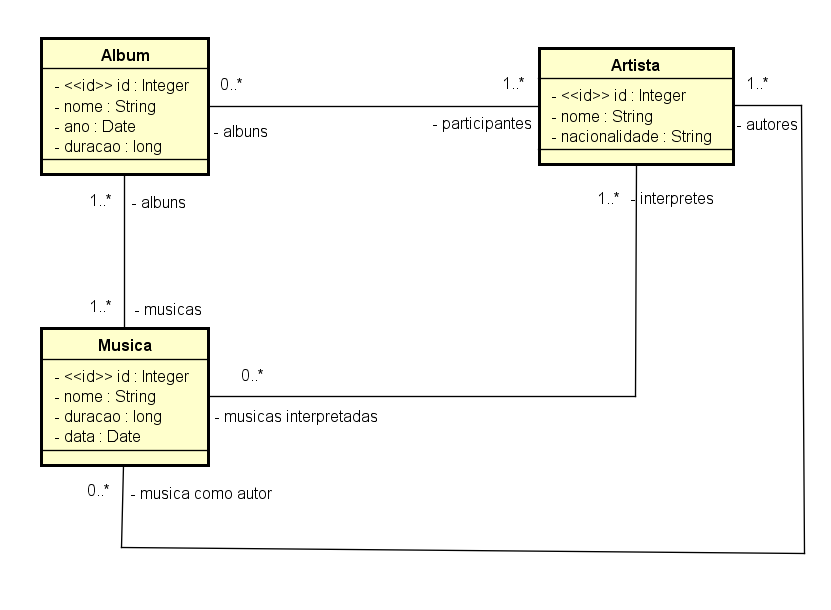

# 💻 Backend Musicando

A api foi desenvolvida para praticar meus conceitos a respeito de api rest e spring.

**Atenção**: Você precisa ter o java jdk 11 instalado na sua máquina bem como o `PATH_VARIABLE` do java configurado e uma IDE de sua preferência.

**O backend está setado em modo de teste, dessa forma, não é necessário nenhum tipo de
configuração para banco de dados, pois está sendo utilizado o banco de dados em memória (H2).**

Execute o comando: `mvn install` para instalar as dependências do maven.

Após baixar as dependências, execute a aplicação e a api estará rodando em http://localhost:8080.

Acesso ao banco de dados **H2**: `http://localhost:8080/h2-console`.

## 🗺️ Diagrama de Classes - Modelo de Domínio


**Obs**: O diagrama está em português para maior entendimento, porém o código está em inglês.

## 📌 Endpoints

Os seguintes endpoints estão configurados:

### Albums
- `/albums` - GET - Exibe todos os álbuns que estejam cadastrados na API.
- `/albums/{id}` - GET - Exibe um álbum específico com seu(s) participante(s) e sua(s) música(s) 
  através do seu Id.

### Musics
- `/musics` - GET - Exibe todas as músicas cadastradas na API.
- `/musics/{id}` - GET - Exibe uma música específica e também seu(s) autor(es) e participante(s) 
  através do seu Id.
- `/musics/{id}` - DELETE - Remove uma música a partir do seu Id.
- `/musics` - POST - Cria uma música.
- `/musics` - PUT - Atualiza as informações de uma música (Nome, data de lançamento, duração, 
  autores e participantes).

**Exemplo de dados para criar uma Música (JSON)**

```json
{
  "name": "any_name",
  "releaseDate": "2021-01-31T15:00:00Z",
  "duration": 260,
  "authors": [
    {
      "id": 1
    }
  ],
  "interpreters": [
    {
      "id": 1
    }
  ]
}
```

**Exemplo de dados para atualizar uma Música (JSON)**

```json
{
  "name": "any_name_edit",
  "releaseDate": "2021-01-31T15:00:00Z",
  "duration": 260,
  "authors": [
    {
      "id": 3
    }
  ],
  "interpreters": [
    {
      "id": 3
    },
    {
      "id": 2
    }
  ]
}
```

### Artists
- `/artists` - GET - Exibe todos os artistas cadastrados na API.
- `/artists/{id}` - GET - Exibe um artista específico através do seu Id.
- `/artists/{id}` - DELETE - Remove um artista a partir do seu Id.
- `/artists` - POST - Cria um artista.
- `/artists` - PUT - Atualiza as informações de um artista (Nome).

**Exemplo de dados para criar um Artista (JSON)**

```json
{
  "name": "any_name",
  "nationality": "any_nationality"
}
```

**Exemplo de dados para atualizar um Artista (JSON)**

```json
{
  "name": "any_name_edit"
}
```

## 🛠️ Ferramentas
1. Java
2. Spring Web
3. Spring Data JPA
4. H2 database


## 💾 Dados para povoar a api
Na pasta `src/main/resources` existe um arquivo **data.sql** com alguns dados já adicionados,
para inserir novos dados, basta incluí-los no arquivo. 